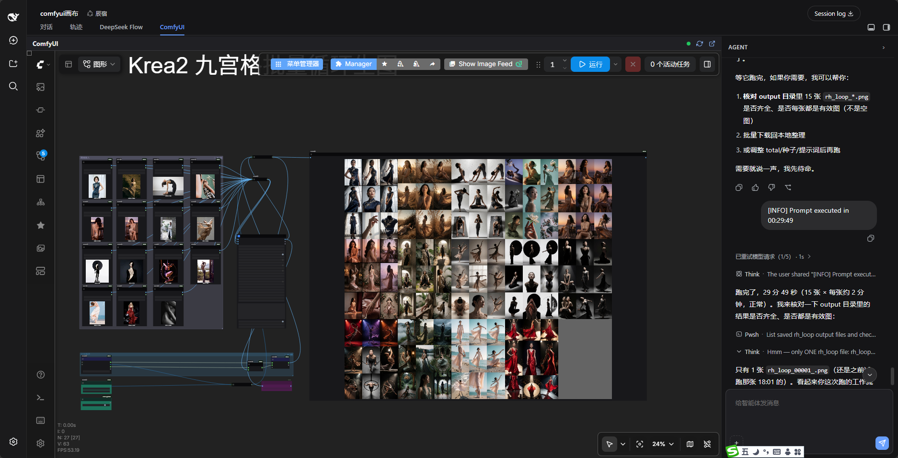

# dsh-comfyui-canvas（DSH 画布插件）

> 中文 · [English](README.md)

[](LICENSE)
[](https://github.com/wbin0001/dsh-comfyui-canvas/releases)
[](https://github.com/wbin0001/dsh-comfyui-canvas)
[](https://github.com/DeepSeek-Harness/DSH)
[](https://github.com/comfyanonymous/ComfyUI)
[](docs/architecture.html)

**关键词**：ComfyUI · Stable Diffusion · 文生图 · 图生图 · AI 绘画 · 工作流 workflow · 音乐 music · 视频 video · 3D · DeepSeek Harness · DSH

> **✅ DSH 版本兼容（v0.1.4 起）**：分屏布局已完全**自包含**在插件内——只用官方 DSH 插槽（`conversation.session.header.utilities`）与 DOM `data-*` 锚点，**零核心改动**。任何官方 DSH **v0.1.x**（含带破坏性 client 更新的 v0.1.2+）都开箱即用、无需补丁。此前分屏 rail 依赖 DSH 私有核心补丁，v0.1.4 已彻底移除该依赖。
> - ❌ **非官方桌面封装**（如 `dsh-desktop` 社区版）不保证兼容——它内部跑的上游版本可能超前/滞后于本插件基线，请以官方 DSH 为准。



**从对话到画布再到作品——DSH 里驾驭 ComfyUI 的可视化工作流 IDE。** 把 **ComfyUI**（本地或云端）以画布分屏嵌入 [DeepSeek Harness](https://github.com/DeepSeek-Harness/DSH) Web，agent 在对话里激发创意、书写提示词与脚本，实时落到你眼前的画布上，产出图像、音乐、视频、3D。从灵感到成品，全程不离开对话，不用切换任何前端工具：

- **画布操作**：搭建编排、读写工作流、修改节点、连线、运行、调整参数、工作流查错——所见即所得，实时落在你眼前的画布上
- **生产任务**：批量扫参（`batch_run`）、自动取回出图（`get_outputs`）带回对话，实现图像、音乐、视频、3D 等多任务智能创作与批量生产
- **环境维护**：一键启动 ComfyUI、一键升级核心与全部自定义节点（`upgrade`），省心维护不间断

本仓库集成了 **DSH 侧插件（画布副驾）+ ComfyUI 侧桥接节点**。需要无人值守 / 规模化执行时，可配合官方 ComfyUI MCP 服务器使用——见[「画布 + MCP」](#画布--mcp同一个-comfyui-的两种驾驶方式)。

---

## 功能特性

| 能力 | 说明 |
|---|---|
| **画布分屏入口** | 点会话标头右侧的 **ComfyUI** 按钮进入**画布左 + 对话 rail 右**的分屏形态——画布内嵌 ComfyUI 前端（本地/云端），右侧是官方对话 rail，边看画布边发消息让 agent 操控。iframe 常驻不重载，再点按钮即关闭分屏。 |
| **分屏布局（自包含）** | ComfyUI 按钮 = 画布左 + 对话右，状态按会话隔离。只用官方插槽（`conversation.session.header.utilities`）+ DOM `data-*` 锚点与 CSS 变量，**零核心改动**，上游样式变化也不受影响。 |
| **可视化画布副驾** | agent 操作**你正在看的画布**——节点出现、连线接上、参数变化、运行触发，全部实时显示在屏幕上，每一步都看得见，而不是黑盒改 JSON。出图经 `comfyui_get_outputs` 直接带回对话。 |
| **画布操作工具** | `comfyui_read_workflow` / `add_node` / `connect` / `set_param` / `remove_node` / `inject_text` / `load_workflow` / `run` / `debug` / `clear` / `group`——在活画布上搭建与修复工作流；`clear` 清出空白画布新建工作流，`group` 把复杂工作流分成具名组（提示词区 / 采样区 / 输出区），`inject_text` 把对话文本一步注入为可连线节点。 |
| **生产工具** | `comfyui_batch_run` 一次扫参数矩阵（seed / prompt / 强度）——支持显式 `runs` 或声明式 `matrix`（`zip` 并行槽位 / `product` 笛卡尔展开）；`comfyui_get_outputs` 把产物直接带回对话——图像、视频、GIF、音频都支持，可传 `outputStem` 自动编号（`stem.01.png`，永不覆盖）；`comfyui_attach_file` 把本机任意文件（图片/音频/视频/3D/**文本**）上传进 ComfyUI `input/` 供对应 Load 节点使用；`comfyui_export_api` 把当前画布导出为 API 格式工作流，供 comfy-cli 无人值守批量。 |
| **桥接节点一键安装** | `comfyui_setup_bridge` 检测 / 安装 / 更新 ComfyUI 侧桥接节点到 `custom_nodes/`（幂等、校验文件、提示何时重启）——不再需要手动复制；`comfyui_config` 一眼报告 `bridgeInstalled` / `bridgeVersion` / `bridgeUpToDate`。 |
| **项目目录与溯源** | 下载默认落「项目目录」（设置页可改，默认 `<工作区>/projects`）；每次下载把 `runs.json`（promptId / overrides / 时间戳 / 文件）追加进项目目录，任意一张图都能追溯回它的生成参数。运行失败返回结构化 `executionError`（节点 id / 节点类型 / 异常类型 / 信息），不再是一堵 JSON 墙。 |
| **技能包（SOP）** | 内置技能教 agent 按正确顺序操作：`comfyui-canvas-ops`（读→确认→改→跑→取回→自检）、`comfyui-admin-ops`（配置/启动/升级/节点管理）、`comfyui-video-audio-ops`（视频+配音/音轨）、`comfyui-dev-ops`（开发/调试自定义节点）。装插件即自带技能，无需额外配置。 |
| **维护工具** | `comfyui_upgrade` 一键升级 ComfyUI 核心与全部 git 自定义节点（并发、跳过本地改过的仓库）；`comfyui_config` 报告当前连接、画布专注状态、项目目录，以及**桥接鉴权握手检查**（`bridgeAuthEffective`）。 |
| **节点开发工具** | `comfyui_read_source` / `comfyui_edit_source` / `comfyui_reload`——对话里直接读写 `custom_nodes/` 下的节点源码并重启 ComfyUI，再到画布上验证。 |
| **画布专注模式（会话隔离）** | agent 通过 `comfyui_config` 感知当前会话是否开启画布分屏，只在画布场景专注画布操作，且**按会话隔离**——多个会话互不干扰。 |
| **ComfyUI 报错处理** | `debug` 校验工作流并高亮报错节点（纯校验，不触发执行），agent 帮你定位/修复画布错误。 |
| **设置页** | ComfyUI 地址 / 端口 / 网络模式 / 桥接 Token / 启动命令 / 项目目录 / 右侧面板宽度，实时生效；显示插件版本号并支持检查 / 一键更新（更新到 npm 最新版后需重启 DSH）。导航栏已自定义为 ComfyUI logo 图标。 |
| **对话栏** | 分屏 rail 复用官方完整对话（消息、输入、发送、贴图、授权弹窗全在），不再需要插件自绘迷你输入框与授权 overlay。 |

---

## 安装

### 1. 安装 DSH 插件

```bash
dsh plugin add dsh-comfyui-canvas
```

或从 GitHub 安装：

```bash
dsh plugin add github:wbin0001/dsh-comfyui-canvas
```

或本地安装：

```bash
# 在 DSH profile 目录下
pnpm add <本仓库路径>
```

插件自带 `cordis.patch.yml`（通过 `dsh.bundle.patch` 声明），装完自动挂载，无需手改配置。

### 2. 安装 ComfyUI 桥接节点（一键）

agent 工具通过 `/dsh-bridge/*` 与 ComfyUI 页面通信。装完插件后，让 agent **「安装 ComfyUI 桥接节点」**（或自己调用 `comfyui_setup_bridge`）：它会检测 `custom_nodes/` 里是否已有桥接节点、把本包内嵌的版本复制过去（幂等——已装同版本或更新则保留）、校验文件、并提示何时重启 ComfyUI。

```text
Agent: comfyui_setup_bridge → { installed, version, upToDate, restartNote }
```

需要先在 **设置 → ComfyUI 画布** 填好 **ComfyUI 安装目录**（或设 `COMFYUI_DIR` 环境变量）。没填时 `comfyui_config` 会报告 `bridgeInstalled: false`——填一次再重跑即可。

手动复制仍然支持（如离线机器）——桥接节点**内嵌在本包** `comfyui-bridge/ComfyUI-DSH-Canvas`：

**Windows（PowerShell / cmd）：**
```powershell
Copy-Item -Recurse (npm root -g)\dsh-comfyui-canvas\comfyui-bridge\ComfyUI-DSH-Canvas <ComfyUI>\custom_nodes\ComfyUI-DSH-Canvas
```

**macOS / Linux（bash）：**
```bash
cp -r $(npm root -g)/dsh-comfyui-canvas/comfyui-bridge/ComfyUI-DSH-Canvas <ComfyUI>/custom_nodes/ComfyUI-DSH-Canvas
```

然后重启 ComfyUI 并打开一次画布页面（注入的 `bridge.js` 会上报画布状态并监听命令）。

### 3. 云端 ComfyUI（桥接节点装在「跑 ComfyUI 的那台机器」上）

`comfyui_setup_bridge` 管理的是**本机**安装（`comfyuiDir` 是本机路径）。云端 / 远程 ComfyUI 请在**云端机器**上装桥接节点——二选一：

**A. 有 SSH / 控制台（自建云 GPU 机）**——在云机上执行：
```bash
# 方式 1：拉取 npm 包，把其中的桥接节点解出来
npm pack dsh-comfyui-canvas && tar -xzf dsh-comfyui-canvas-*.tgz && cp -r package/comfyui-bridge/ComfyUI-DSH-Canvas <ComfyUI>/custom_nodes/

# 方式 2：从 GitHub 仓库稀疏检出桥接节点目录
cd <ComfyUI>/custom_nodes
git clone --depth 1 --filter=blob:none --sparse https://github.com/wbin0001/dsh-comfyui-canvas.git
cd dsh-comfyui-canvas && git sparse-checkout set comfyui-bridge/ComfyUI-DSH-Canvas
mv comfyui-bridge/ComfyUI-DSH-Canvas ../ComfyUI-DSH-Canvas && cd .. && rm -rf dsh-comfyui-canvas
```
然后重启云端 ComfyUI，把插件 `baseUrl` 指向云端地址，并（推荐）两端设置一致的 `DSH_BRIDGE_TOKEN`（见安全章节）。

**B. 托管 SaaS（只有 API、无 shell）**——若托管方不允许装自定义节点，桥接（以及可视化画布）不可用；请走纯 API/MCP 路径（`comfyui_export_api` → comfy-cli / MCP server）做无人值守运行。此时 `comfyui_config` 会报告 `bridgeInstalled: false`。

### 4. 配置

打开 **设置 → ComfyUI 画布**，填写 ComfyUI 地址（默认 `http://127.0.0.1:8188`）、端口、网络模式、可选桥接 Token、启动命令和右侧面板宽度。

**启动命令**按平台不同：

| 平台 | 示例 |
|---|---|
| Windows | `ComfyUI启动器.bat`（或 `python main.py`） |
| macOS | `python main.py` 或 `./start.sh` |
| Linux | `python main.py` 或 `./start.sh` |

---

## 安全

桥接（`/dsh-bridge/*`）是本插件给 ComfyUI 新增的唯一网络面。把 ComfyUI 暴露到回环地址之外之前请先读这里。

- **信任模型**。默认桥接无鉴权，与 ComfyUI 自身 `/prompt` 的信任模型一致——任何能访问 ComfyUI 端口的人都能读画布、上报状态、下发命令（`load_workflow`/`run` 会消耗 GPU）。前端有命令白名单，**无法**执行任意代码，但这个面是真实存在的。
- **绑定回环**。除非确有局域网/云端需求，请让 ComfyUI 保持 `127.0.0.1`。`networkMode` 只是信息性字段；实际绑定取决于 ComfyUI 启动时的 `--listen`。
- **可选共享 Token**。在 **设置 → ComfyUI 画布 → 桥接 Token** 里填一个 Token，同时用相同值启动 ComfyUI（给它自己的环境变量 `DSH_BRIDGE_TOKEN=...`）。启用后，每个**由 agent 发起**的请求——读画布、下发命令、轮询结果——都必须携带 `Authorization: Bearer <token>`；host 端自动带上，bridge 端拒绝没有 Token 的请求。前端自身的状态上报（`/report`、结果回传）保持开放，因为注入页面无法持有 Token；这些端点只改动内存快照、从不触发执行。两端都留空则保持默认开放行为。
- **多标签页安全**。命令会定向到「最近上报的前端」（`clientId`），所以同时开着多个 ComfyUI 标签页不会各自执行一次命令。

---

## 平台支持

支持 **Windows / macOS / Linux**。agent 工具通过纯 HTTP（`/dsh-bridge/*`）与 ComfyUI 通信，插件本身不依赖任何平台特性——只有**复制命令**和 **ComfyUI 启动命令**因平台而异，上面都已分别说明。

---

## 使用

1. 打开一个会话，点会话标头右侧的 **ComfyUI** 按钮——进入**画布左 + 对话 rail 右**的分屏形态（再点一次即关闭分屏，回到纯对话）。
2. 直接让 agent 干画布活：
   - *“读取当前工作流”*
   - *“给 KSampler 设 seed 为 42”*
   - *“检查画布有没有报错”*
   - *“运行一次”*
3. agent 会先读 `comfyui_config` 确认当前在画布模式，然后专注画布操作。

### 对话产物 → 画布

agent 在对话里生成的图片与文本，可直接作为 ComfyUI 工作流的节点输入，形成「对话创意 → 画布产出」闭环：

- `comfyui_attach_image`：把本机一张图片上传进 ComfyUI `input/`，并可选指向某个 LoadImage 节点。走 ComfyUI 原生 `/upload/image`，不经桥接——文件读取与上传由 host 从本机发起（云端 ComfyUI 场景下 DSH 机器与 ComfyUI 机器可能不同机，必须由 host 发起）。
- `comfyui_inject_text`：把一段文本写入某节点 widget；或新建一个源节点、填值、再连到目标输入——「对话文本作为独立可连线源」。是 `add_node + set_param + connect` 的一步封装；只改已有 widget 时 `set_param` 已够，`inject_text` 用于「新建源并连线」。
- `comfyui_export_api`：把当前画布导出为 API 格式工作流 JSON（`/prompt` 与 comfy-cli `run_workflow` 所需格式），打通「画布 ↔ MCP」衔接——画布上调好图，导出后交 comfy-cli 无人值守批量跑。

> 架构边界：文件传输（图片→`input/`）走 host + 原生 API；画布节点操作走桥接 command；读结果走原生 `/history`+`/view`，三层不混。

### 画布 + MCP——同一个 ComfyUI 的两种驾驶方式

本插件是**画布驱动**：它看到并编辑用户**正在看的那张活画布**（加节点、连线、改参数、运行，并用 `comfyui_get_outputs` 取回本次出图、用 `comfyui_batch_run` 扫参），无需保存工作流文件。

要做**流水线/无人值守**类批量任务时，ComfyUI 官方的 **Comfy CLI（comfy-cli，独立 Python CLI，也可对外暴露 MCP 服务器）** 是互补的执行端。两者不是二选一，而是**同一个 ComfyUI 实例的两种驾驶方式**，合起来覆盖工作流全生命周期：

| 工作流阶段 | 驾驶方式 | 能力 |
|---|---|---|
| 搭建 / 调优 | **画布插件**（bridge） | 活画布编辑、运行、`debug` 校验、`get_outputs` 取图 |
| 固化 / 导出 | **画布插件** | `comfyui_export_api`——把调好的图导出为 API 格式 JSON |
| 批量 / 无人值守规模化 | **MCP / comfy-cli** | 跑同一张图：批量队列、官方模板、模型管理、托管模型 |
| 结果带回对话 | **画布插件** | `comfyui_get_outputs` 把运行产物拉回对话 |

**闭环**：画布上调优 → `export_api` 导出 → 交 MCP / comfy-cli 无人值守规模化跑 → `get_outputs` 取回结果。全程不离开 DSH，画布与无头两种模式互补而非替代。安装 Comfy CLI：

```bash
pip install comfy-cli   # 独立 CLI，非 DSH 插件 —— 见 https://github.com/Comfy-Org/comfy-cli
```

### 工作流操作模式（agent 如何驾驭画布）

内置 `comfyui-canvas-ops` 技能会引导 agent 按场景选择操作模式：

| 场景 | 模式 |
|---|---|
| **修改现有工作流** | 在当前画布上**增量编辑**（`set_param` / `connect` / `add_node` / `remove_node` / `inject_text`）——绝不用整图 `load_workflow` 冲掉未保存现场 |
| **新建工作流** | `comfyui_clear`（清出空白画布，带 `confirm` 防误清）再逐步搭 |
| **搭建复杂工作流** | `comfyui_group`——分成具名组（提示词区 / 采样区 / 输出区） |
| **快速验证 / 批量 / 无人值守** | **API/MCP 路径**——直接提交 API 格式工作流（或经 MCP server），不必可视化画布 |

agent 动手前先判断场景：用户在实时看画布 / 需要调优 → 画布路径；快速验证、批量扫参、无人值守 → API/MCP 路径。

---

## 环境要求

- DeepSeek Harness Web（DSH），Node `^22.19.0 || >=24`
- 运行中的 ComfyUI（默认本地 `127.0.0.1:8188`；云端需在「跑 ComfyUI 的那台机器」上装桥接节点并确保 DSH 可达），且已装桥接节点（`comfyui_setup_bridge` 一键完成）
- 浏览器打开过 ComfyUI 画布页（画布标签会自动加载）

---

## 开发

```bash
npm run check   # node --check 校验 lib 两个文件
```

插件位于 DSH profile 的 `node_modules/dsh-comfyui-canvas`；`lib/index.js` 是 host 端工具、`lib/client.js` 是 web 端，改完重启 DSH 生效。

---

## 仓库结构

```
dsh-comfyui-canvas/
├── cordis.patch.yml          # DSH bundle 加载层（自动挂载）
├── comfyui-bridge/           # ComfyUI 侧桥接节点（随仓库发布）
│   └── ComfyUI-DSH-Canvas/
│       ├── __init__.py       # ComfyUI 服务端 /dsh-bridge/* 路由
│       └── entry/bridge.js   # 注入画布前端：上报画布 + 执行命令
├── lib/
│   ├── index.js              # DSH host：15 个画布工具 + 会话隔离模式
│   └── client.js             # DSH web：分屏画布（画布左+对话右）/ 设置页
├── LICENSE
├── README.md
├── README.zh.md              # 本文档
└── package.json
```

**桥接节点**是唯一的 ComfyUI 侧依赖：它暴露 `/dsh-bridge/workflow | report | command | result`，并通过 `app.registerExtension` 注入画布页面；没有它 agent 工具就够不到画布。

---

## 已知问题

- `comfyui_reload` 目前**仅支持 Windows**（依赖 `netstat`/`taskkill`）；macOS/Linux 上会明确报错而非假装成功，需手动重启 ComfyUI。
- 此前"画布运行后节点预览不显示"已在 v0.1.1 修复：移除 iframe 的 `referrerpolicy="no-referrer"` 消除环境差异，并在 `bridge.js` 监听 ComfyUI `executed` 事件强制重绘画布。

---

## 许可证

MIT
